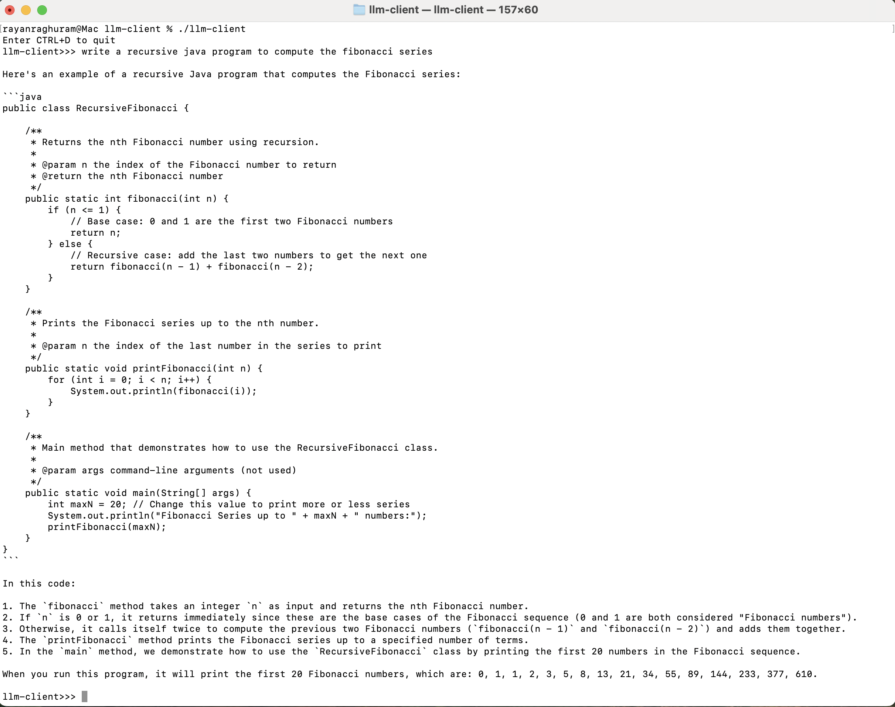

# LLM Command Line Client

A Proof of Concept (POC) of a command line llm-server client to chat with llm server written in Go.

⚠️ NOTE
This code is not production-ready and is intended solely for proof-of-concept (PoC) and demonstration purposes. It lacks production-grade features such as authentication, request limits, error handling, hardening, and full model lifecycle management.

# Prequisites

1) [`llm-server`](https://github.com/rraghura102/llm-server) is running.

# MAC ARM Build

1) Build and Run

```
rm llm-client
rm go.*

go mod init llm-client
go mod tidy
go build llm-client
```

# Run 

```
./llm-client
```


